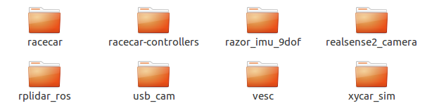
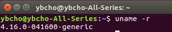
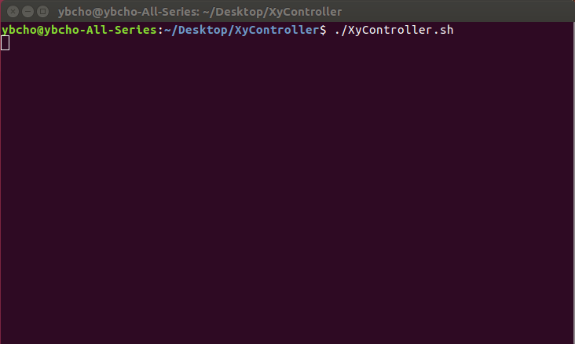
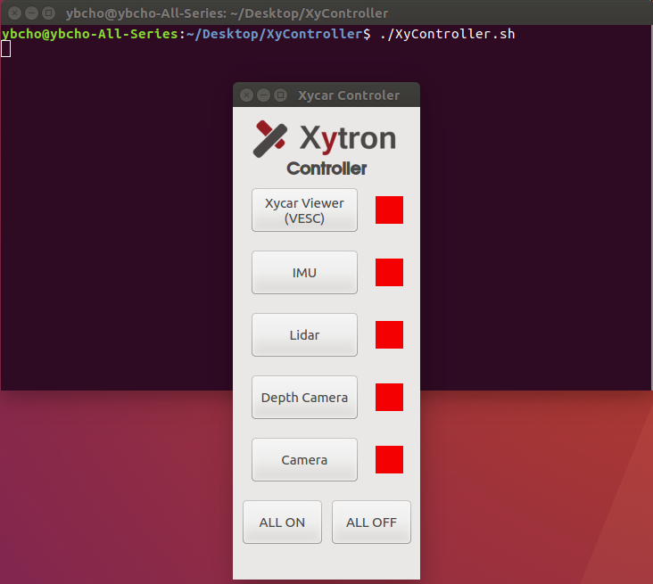
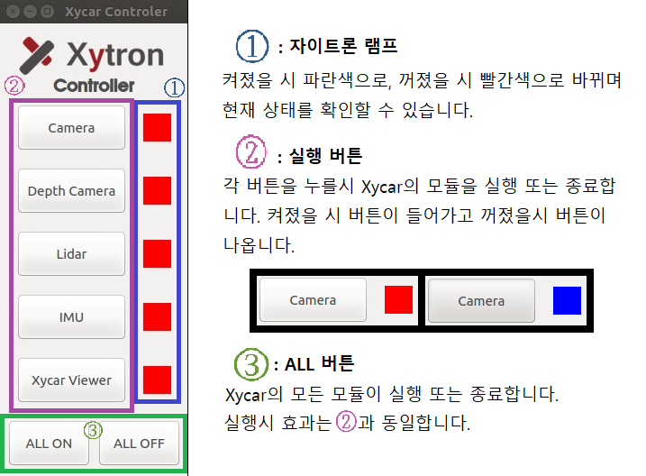
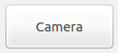
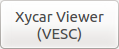
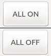

Xycar Viewer  
=============

Table of Contents

[[Xycar Viewer]](#xycar-viewer)

[[Purpose]](#purpose)

[[의존성]](#의존성)

[[실행]](#실행)

[[InterFACE]](#interface)

Purpose 
--------

-   Xycar Viewer를 통하여 terminal을 통하지 않고 쉽고 편리하게 각 모듈의
    viewer를 호출하기 위해 제작되었습니다.

-   프로그램은 Python3 과 PyQt5 를 이용하여 제작하였으며, UI는 PyQt5를,
    실행 코드는 Python을 이용하여 각각 별도로 제작되었습니다.

의존성
------

-   이 프로그램은 아래의 조건에서만 사용 가능합니다.

<!-- -->

-   리눅스 커널 4.16 이상

-   Python 3.5 이상의 버전

-   PyQt 5.11 이상의 버전

-   이하의 ROS 패키지

<!-- -->

-   Realsense2 패키지 이외의 설치에 관해서는 Xycar 설치 가이드를 참고하시기 바랍니다.

<!-- -->

-   Real Sense2 패키지 설치.

<!-- -->

-   리눅스 커널 4.16 버전 설치

> [[http://kernel.ubuntu.com/\~kernel-ppa/mainline/v4.16/]](http://kernel.ubuntu.com/~kernel-ppa/mainline/v4.16/)
>
> 위 사이트에서 자신의 컴퓨터에 맞는 아래의 세가지 파일을 다운 받는다.

-   linux-headers-4.16.0-xxx...

-   linux-headers-4.16.0-xxx-generic-xxx...

-   linux-image-4.16.0-xxx-generic-xxx...

<!-- -->

-   사이트에 가보면 lowlatency 와 generic이 있는데 그것을 구분하는
    방법으로는 uname -r을 쳐보면 된다. 리눅스 콘솔 화면에 uname -r을
    쳤을 때 맨 끝에 generic이 나오면 generic을 다운받으면 되고,
    lowlatency가 나오면 lowlatency를 다운받으면 된다.

> 다운 받은 파일들을 차례로 설치 한다.

-   dpkg --i linux-headers-4.16.0-xxx...

-   dpkg --i linux-headers-4.16.0-xxx-generic-xxx...

-   dpkg --i linux-image-4.16.0-xxx-generic-xxx...

> 그후 reboot 해주면 uname --r 을 쳤을 때 다음과 같이 나오면 다음과 같이
> 출력된다.
>
> 

-   RealSense SDK 설치

> 아래의 명령을 차례차례 따라한다.

-   sudo apt-key adv \--keyserver keys.gnupg.net \--recv-key
    C8B3A55A6F3EFCDE \|\| sudo apt-key adv \--keyserver
    hkp://keyserver.ubuntu.com:80 --recv-key C8B3A55A6F3EFCDE

-   sudo add-apt-repository \"deb
    http://realsense-hw-public.s3.amazonaws.com/Debian/apt-repo xenial
    main\" -u

-   sudo rm -f /etc/apt/sources.list.d/realsense-public.list

-   sudo apt-get update

-   sudo apt-get install librealsense2-dkms

-   sudo apt-get install librealsense2-utils

-   sudo apt-get install librealsense2-dev

-   sudo apt-get install librealsense2-dbg

<!-- -->

-   RealSense ROS Package 설치

> 버전이 많이 나와있는데, 그 중에서도 2.0.3 버전을 설치한다.

-   cd \~/Downloads

-   wget https://github.com/intel-ros/realsense/archive/2.0.3.tar.gz

-   tar -zxvf ./realsense-2.0.3.tar.gz

-   mv -rf ./realsense-2.0.3/realsense2\_camera \~/xycar/src

-   cd \~/xycar

-   catkin\_make clean

-   catkin\_make -DCATKIN\_ENABLE\_TESTING=False
    -DCMAKE\_BUILD\_TYPE=Release

-   catkin\_make install

-   source \~/.bashrc

실행
----

1)  폴더에 아래와 같은 파일이 있는지 확인합니다.

- XyController.sh

- XyController.py

- XyController.ui

- xytron-logo-eng-170x50\_transp.png

2)  ./ XyController.sh 명령어를
​    입력합니다.

부팅이 된지 얼마 안되었다면,
XyController에 필요한 요소들이 부팅될 때 까지 위 사진처럼 대기 한 후
프로그램이 실행됩니다.

InterFACE
---------

1)  INTERFACE

> 

2)  버튼

- Camera

  - USB CAM의 영상을 출력한다.

  - 출력 영상은 theora 수준으로 지정되어 있다.  (영상 크기 : raw\>compressed\>theora)

-   Depth Camera
    -   Realsense Camera의 영상을 Pointcloud 형태로 변환, RViz window를 통해 출력한다.

- Lidar

  -   LIDAR Data를 RViz window를 통하여 출력한다.

- IMU

  -   IMU의 데이터를 실시간 출력한다.
  -   Main Screen과 Roll, Pitch, Yaw를 수치화한 window 두 가지로 나타난다.

- Xycar Viewer
  - 차량의 속도, 핸들 스티어링 데이터를 RViz window를 통하여 출력한다.

-   ALL ON / OFF

    -   전 모듈의 Viewer를 모두 가동/종료한다.

